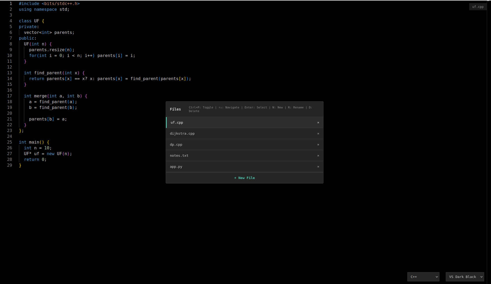

# Free Code Editor

A minimalist, browser-based code editor powered by Monaco Editor with advanced multi-file management and keyboard-driven navigation.



## Features

### Core Editor
- **Monaco Editor** - The same editor that powers VS Code
- **Syntax Highlighting** - Support for 15+ languages including C++, Python, JavaScript, Java, and more
- **Multiple Themes** - VS Dark Black, VS Code Dark, and VS Code Light
- **Auto-save** - Your work is automatically saved to browser localStorage
- **No Installation** - Runs entirely in your browser

### Multi-File Management
- **Unlimited Files** - Create and manage multiple files simultaneously
- **Keyboard-Driven Navigation** - Fast file switching with Ctrl+P
- **Live Preview** - Preview files as you navigate with arrow keys
- **Smart Deletion** - Confirmation prompts when deleting files with content
- **Auto-Rename** - New files prompt for naming immediately

### File Operations
- **Create** - Press `N` in file switcher or click "+ New File"
- **Rename** - Press `R` or double-click a file name
- **Delete** - Press `D` or click the × button
- **Switch** - Click a file or use arrow keys for instant preview

## Keyboard Shortcuts

### Global
| Shortcut | Action |
|----------|--------|
| `Ctrl+P` | Toggle file switcher |

### File Switcher (when open)
| Shortcut | Action |
|----------|--------|
| `↑` `↓` | Navigate files with live preview |
| `Enter` | Close file switcher |
| `Esc` | Close file switcher |
| `N` | Create new file |
| `R` | Rename selected file |
| `D` | Delete selected file |

### File List
- **Single Click** - Switch to file
- **Double Click** - Rename file
- **× Button** - Delete file

## Usage

### Quick Start
1. Open `index.html` in your browser
2. Start typing in the editor
3. Press `Ctrl+P` to open the file switcher
4. Press `N` to create a new file

### Multi-File Workflow
1. Press `Ctrl+P` to open the file switcher
2. Use `↑` and `↓` arrows to navigate between files (live preview)
3. Press `N` to create a new file
4. Type a name and start coding
5. Press `R` to rename the selected file
6. Press `D` to delete the selected file (with confirmation if it contains data)

### Language Selection
- Use the dropdown at the bottom-right to change the language
- New files default to C++
- Language preference is saved per file

### Theme Selection
- Choose from VS Dark Black (default), VS Code Dark, or VS Code Light
- Theme preference is saved automatically

## Technologies Used

- **Monaco Editor** - Microsoft's code editor (powers VS Code)
- **localStorage API** - Persistent file storage in browser
- **HTML5/CSS3** - Modern, responsive interface
- **Vanilla JavaScript** - No frameworks, pure performance

## Browser Compatibility

Works in all modern browsers:
- Chrome/Edge (recommended)
- Firefox
- Safari
- Opera

## Live Demo

Visit the [GitHub Pages site](https://sofyanmahmoud0000.github.io/free-code/) to try it out.

## Features Roadmap

- [x] Multi-file management
- [x] Keyboard shortcuts
- [x] Auto-save
- [x] File deletion warnings
- [x] Live file preview
- [ ] File download
- [ ] File upload
- [ ] Search and replace
- [ ] Code formatting

## Local Development

Simply clone the repository and open `index.html` in your browser:

```bash
git clone https://github.com/SofyanMahmoud0000/free-code.git
cd free-code
# Open index.html in your browser
```

No build process, no dependencies to install!

## License

MIT License - Feel free to use this project however you like.

## Contributing

Contributions are welcome! Feel free to open issues or submit pull requests.

---

Built with ❤️ using Monaco Editor
